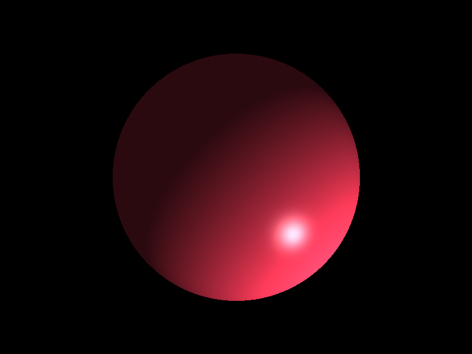
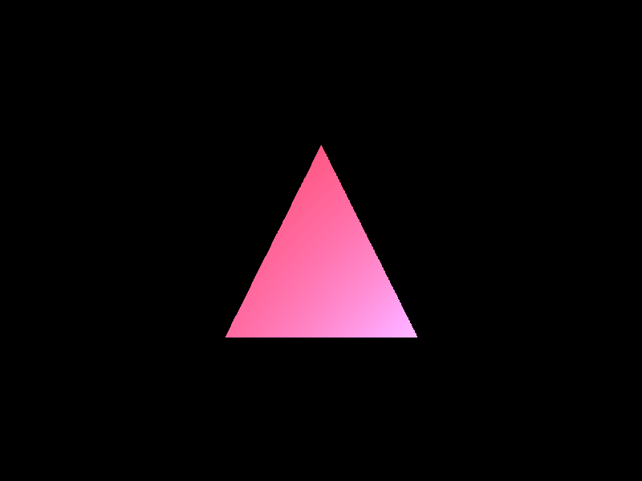
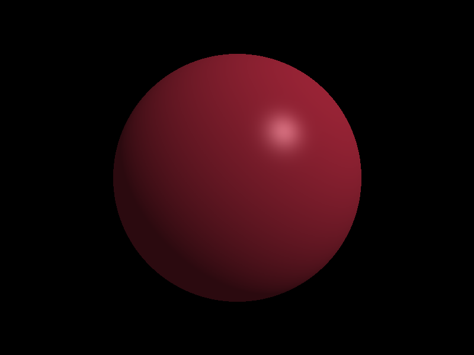
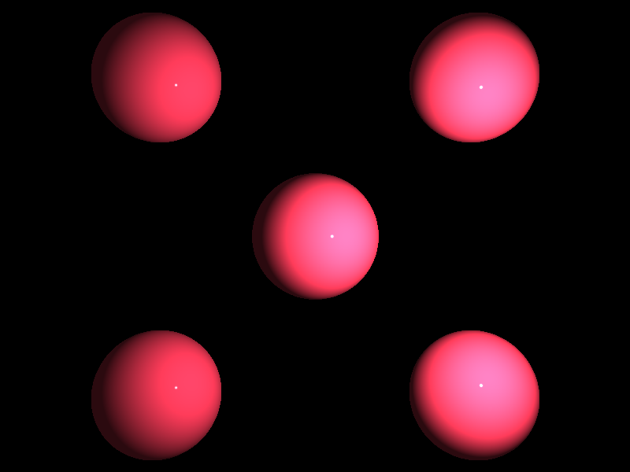
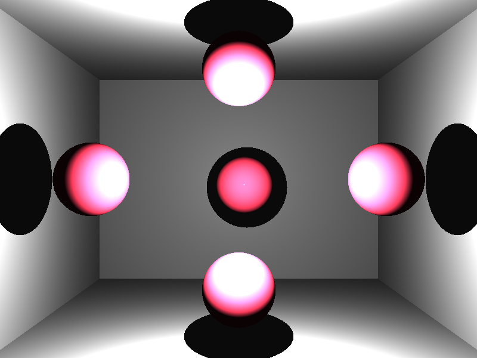
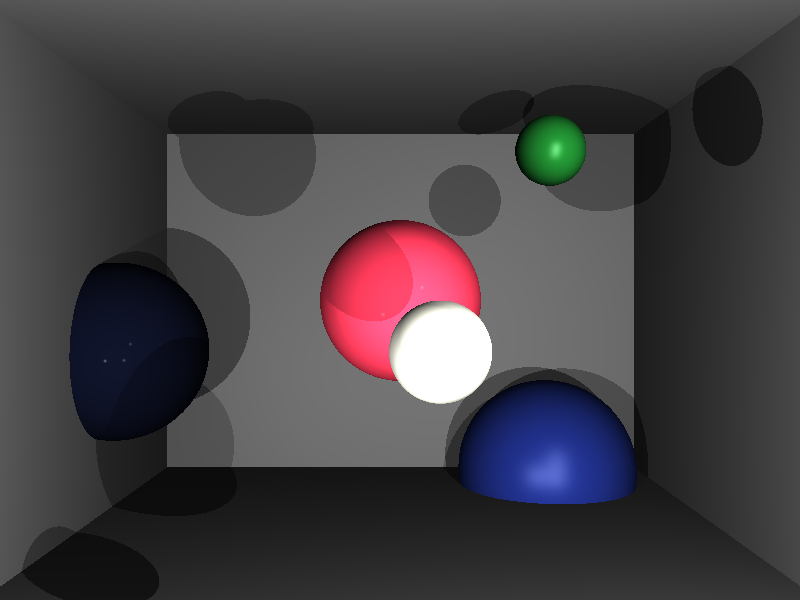
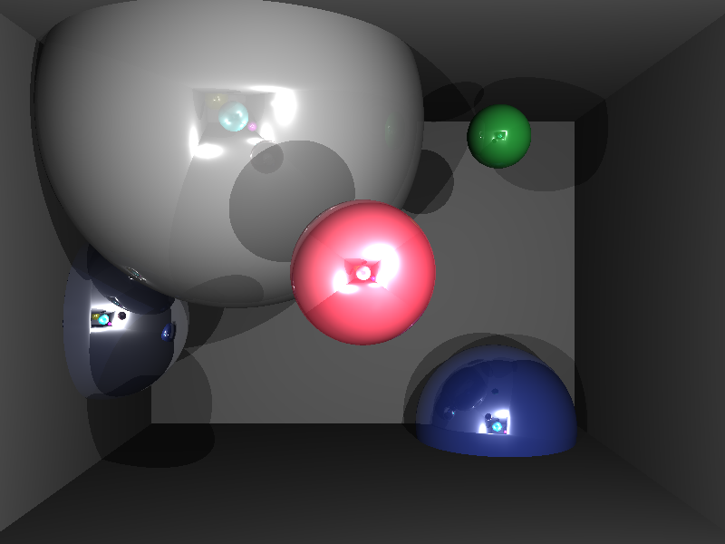

# Raytracer

Raytracer is a C++ university project that demonstrates the fundamentals of ray tracing, a technique used in computer graphics to simulate the way light interacts with objects to produce realistic images.
## Setup

1. **Clone the Repository**:

   ```bash
   git clone https://github.com/zhonissovsuleimen/opengl-cutscene.git
   ```
   
2. **Build the Project**:
   Navigate to the project directory and execute CMake:
   
   ```bash
   cmake src\CMakeLists.txt
   ```

   Open opengl-cutscene.sln and build the Release version.
  
4. **Run the Project**:

   ```bash
   Release\homework4_exe.exe data\example12.scene
   ```
   The scene number can be 1 - 12 inclusive

# Examples








